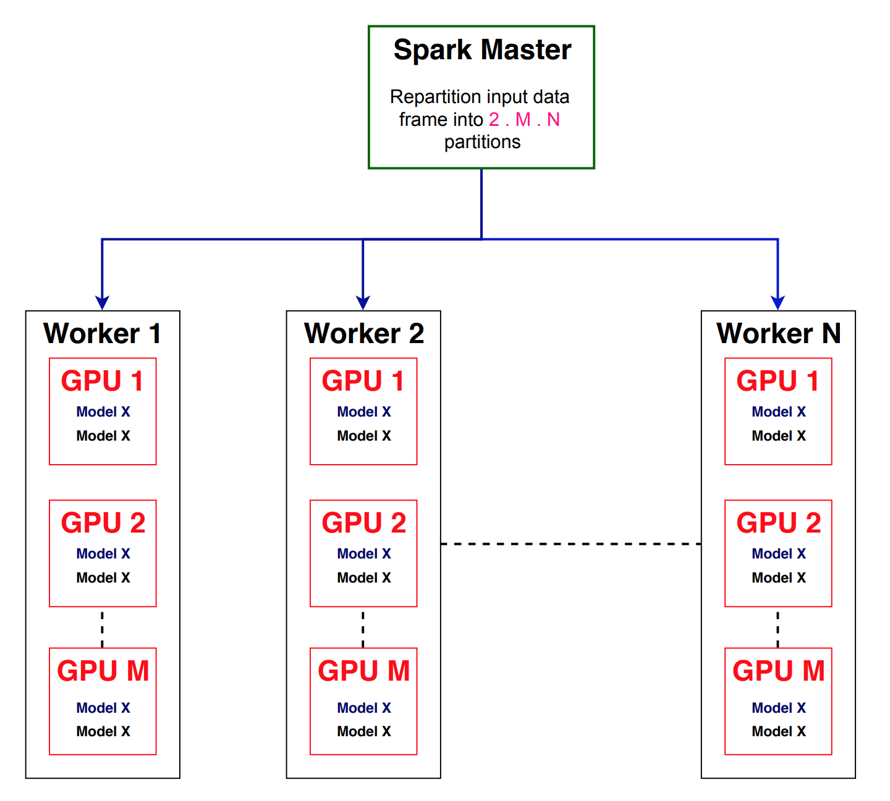

# Coupling PySpark Transformation with PyTorch Inference

## 1. Introduction
* A critical task for machine learning (ML) engineers is to apply ML models on big datasets. It is necessary to load an ML model on the cloud and conduct the inference phase on a big dataset. We may need to repeat this step for **<i>different</i>** ML models within our data flows.

* **Spark** has become a most widely used data processing engine and rich external ML libraries such as **PyTorch** have become ubiquitous in ML research. Although recent open-source efforts try to bind PyTorch with Spark (e.g. https://github.com/dmmiller612/sparktorch), the following code snippet provides a **simple**, yet **effective** **PySpark** transformation for inference of ML models. We tightly couple the inference workload (implemented in **PyTorch**) to a data processing engine (**Spark**).

## 2. Inference Architecture
1. Each worker has **M** GPU cards.
2. Each worker has access to the ML models with all the data and configuration files.
3. For example, each GPU card can host **two** ML models of the same type.
4. We have **N** workers in total.
5. Therefore, we partition the input dataframe into **2 x M x N** partitions.
6. We load **2 x M x N** models of the same type, one model per partition.



## 3. Local Model Loading
* We assume the following design pattern for loading models locally on each worker:
1. The **ModelLoader** class that finds the right configuration for loading different ml models.
2. The **bring_up_model ()** method of **ModelLoader** loads a specific model locally and returns its object.
3. The model object has the **predict (rows)** generator that receives a list of rows and adds the predicted output to each row. Specifically, it will add two extra columns to the input rows: **predicted_class**, and **confidence**.
4. The **LocalPredictor** maps a specific partition to a gpu device and loads the model. Without GPU cards, it uses CPU cores.

```python
import torch

class ModelLoader:
    """ class for loading different models. """

    @abstractmethod
    def bring_up_model(self, ml_task, gpu=True,
                       gpu_device=0, batch_size=8):
        """ brings up a specific model on a gpu_device.
        Returns the model object.
        """
        pass


def LocalPredictor(ml_task, batch_size=16, partition_index=0):
    """ Loads one model locally according to the partition_index """
    model_loader = ModelLoader()
    num_gpus = torch.cuda.device_count()
    has_gpu = torch.cuda.is_available()
    if has_gpu and num_gpus != 0:
        # map the partition_index to the correct gpu_id for balanced loading.
        gpu_id = partition_index % num_gpus
        model = model_loader.bring_up_model(ml_task, gpu=True,
                                            gpu_device=gpu_id,
                                            batch_size=batch_size)
    else:
        # try cpu
        model = model_loader.bring_up_model(ml_task, batch_size=batch_size)

    return model
```

## 4. PySpark Transformation
* We implement **predict_map()** transformation that loads a model locally on each executor. It sends a batch of input rows to the **ml model object** for prediction. It also applies arbitrary **row_preprocessor()** and **row_postprocessor()** on each row of the partition. These extra functions give flexibilty to **predict_map()** to be useful for various types of ML models by conducting feature engineering outside of the ML model, or post processing the results after the ML prediction (such as applying a specific logic on the output row).

```python
import pyspark
from pyspark.sql import Row

def basic_row_handler(row):
    return row

def predict_map(index, partition, ml_task,
                batch_size=16,
                row_preprocessor=basic_row_handler,
                row_postprocessor=basic_row_handler):

    # local model loading within each executor
    model = LocalPredictor(ml_task=ml_task, batch_size=batch_size,
                           partition_index=index)

    batch = []
    count = 0
    for row in partition:
        row_dict = row.asDict()
        # apply preprocessor on each row.
        row_dict_prep = row_preprocessor(row_dict)
        batch.append(row_dict_prep)
        count += 1
        if count == batch_size:
            # predict the ml and apply the postprocessor.
            for ret_row in model.predict(batch):  # ml prediction
                ret_row_post = row_postprocessor(ret_row)
                if ret_row_post is not None:
                    yield Row(**ret_row_post)

            batch = []
            count = 0

    # Flush remaining rows in the batches.
    if count != 0:
        for ret_row in model.predict(batch):  # ml prediction
            ret_row_post = row_postprocessor(ret_row)
            if ret_row_post is not None:
                yield Row(**ret_row_post)

        batch = []
        count = 0
```
## 5. Final PySpark Function
* The final PySpark function repartitions the full input dataframe and applies our prediction transformation **predict_map()**. We make sure that the final dataframe after ML prediction has the extra added columns given by the ML model object.

```python
from pyspark.sql.types import (StructField, StructType, StringType)

def spark_ml_predict(spark_session, dataframe, ml_task,
                     parallel=8, batch_size=16,
                     row_preprocessor=basic_row_handler,
                     row_postprocessor=basic_row_handler):
    """ Apply the ML model on the dataframe """
    
    # repartition the input data frame to 'parallel' partitions.
    df = dataframe.coalesce(parallel)

    rdd = df.rdd.mapPartitionsWithIndex(lambda index, partition:
                                        predict_map(index,
                                                    partition,
                                                    ml_task,
                                                    batch_size,
                                                    row_preprocessor,
                                                    row_postprocessor))

    # defining new schema of String Type, faster than toDF()
    all_cols = df.columns
    all_cols.append('confidence')
    all_cols.append('predicted_class')
    new_fields = []
    for field_name in all_cols:
        new_fields.append(StructField(field_name, StringType(), True))
    string_schema = StructType(new_fields)
    if not rdd.isEmpty():
        return spark_session.createDataFrame(rdd, string_schema)
    return dataframe
```

## 6. Conclusion
* We provided a simple, yet effective PySpark transformation and the underlying PyTorch design patterns for distributed inference of different ml models.

